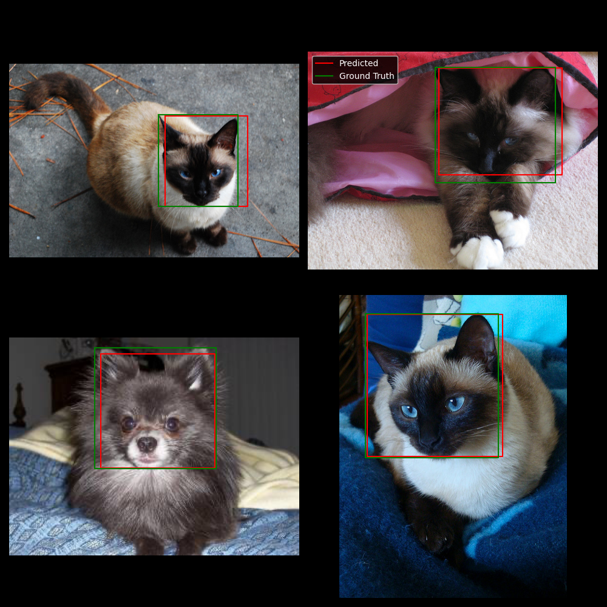

Use Meta's DINOv2 for object detection of cat and dog faces. With a couple thousand examples, the model is basically perfect. Incredible.

- [DINOv2 github](https://github.com/facebookresearch/dinov2)
- [cat and dog object detection dataset](https://www.kaggle.com/datasets/andrewmvd/dog-and-cat-detection)

### Example predictions

